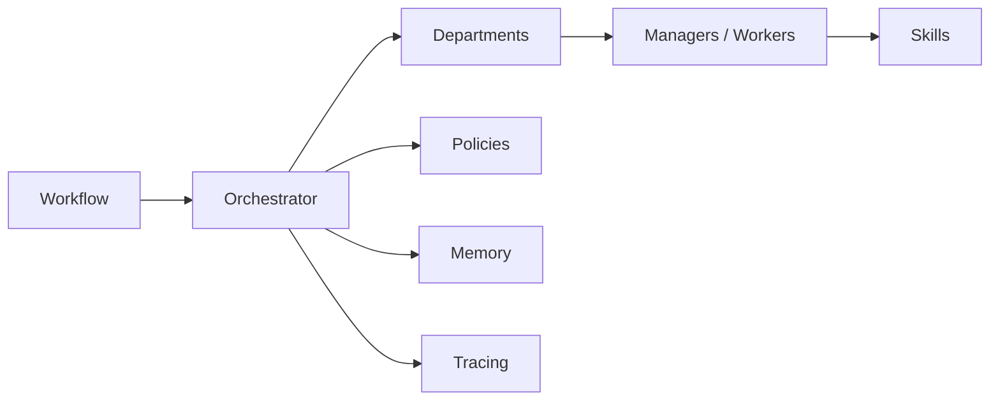

# Architecture Deep Dive

## Layers

- Orchestrator
- Departments
- Agents
- Skills
- Policies
- Memory adapters
- Observability hooks
- Human checkpoints

## Diagram

```mermaid
flowchart LR
    A["Workflow"] --> B["Orchestrator"]
    B --> C["Departments"]
    C --> D["Managers / Workers"]
    D --> E["Skills"]
    B --> F["Policies"]
    B --> G["Memory"]
    B --> H["Tracing"]
```

